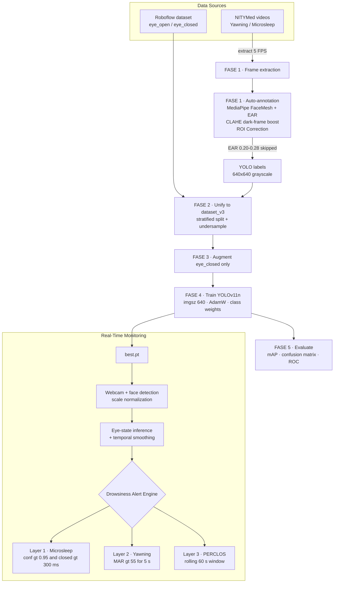
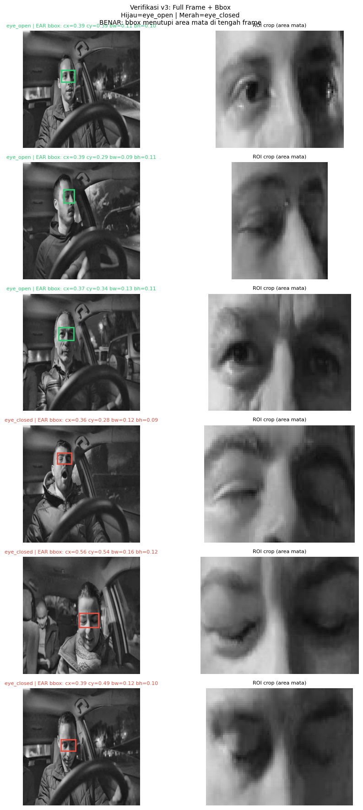
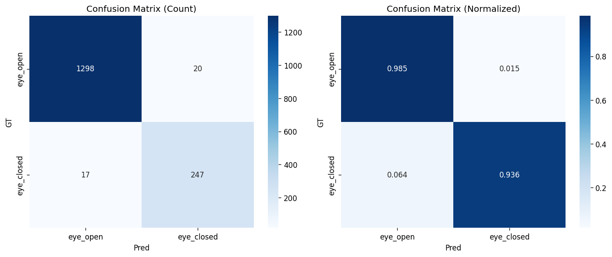
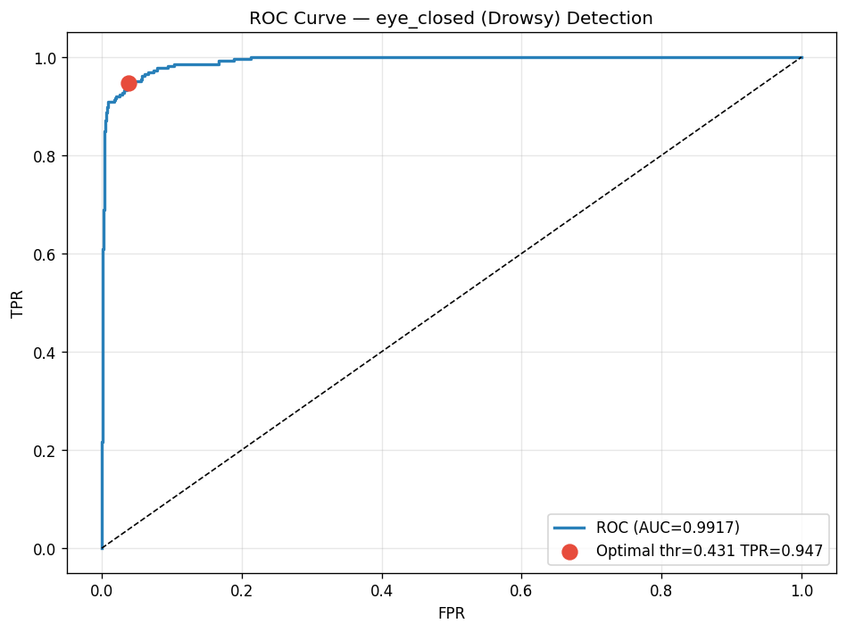
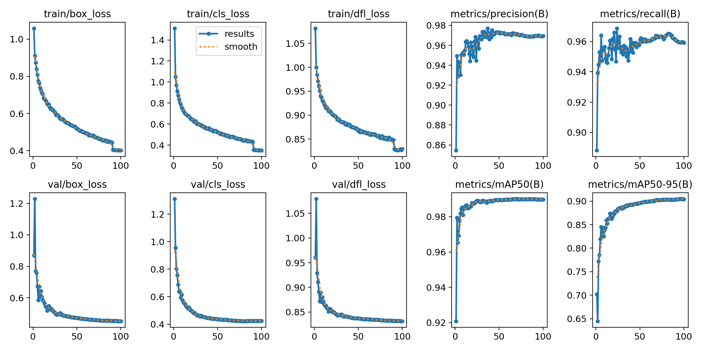
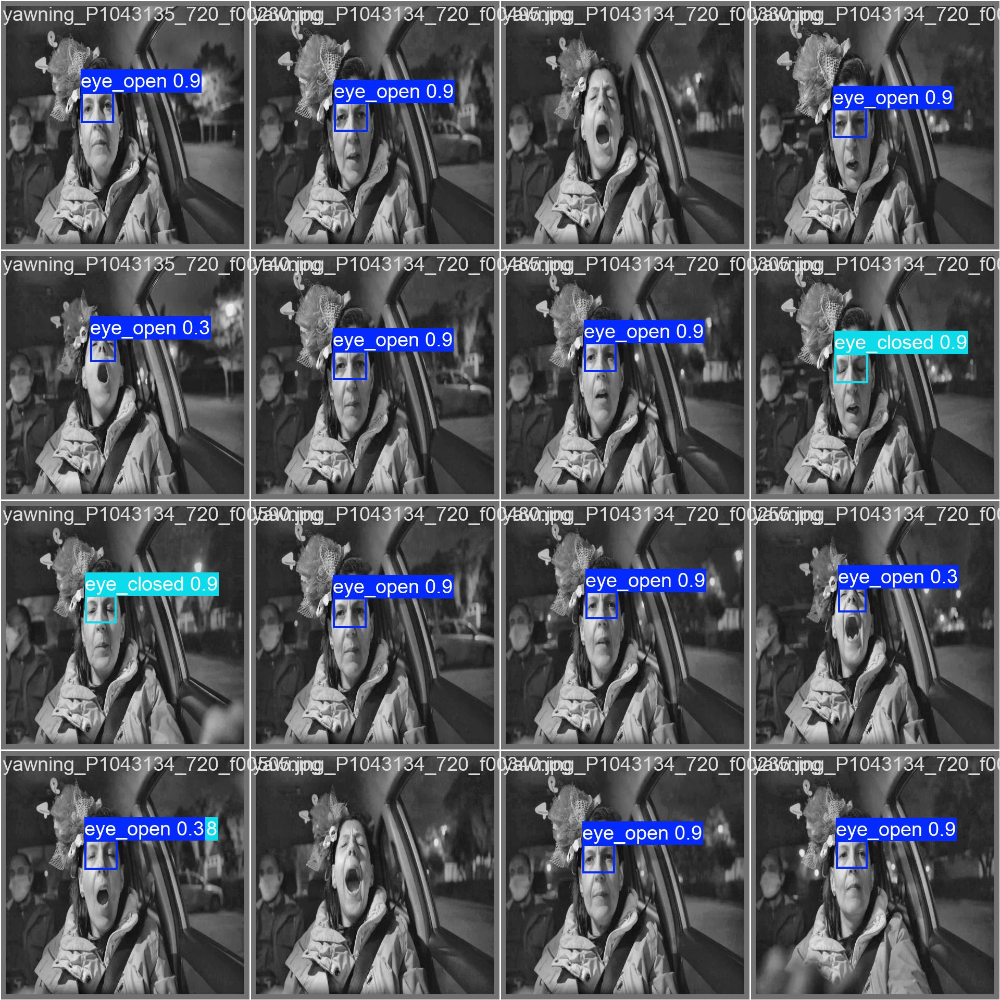

# YOLOv11n — Real-Time Driver Drowsiness Detection

**Real-Time Driver Fatigue Monitoring in Diverse Lighting: An Optimized YOLOv11n Architecture**

[](https://colab.research.google.com/github/JordanCodeGit/YOLOv11n-DrowsinessDetection/blob/main/Drowsiness_Detection_Viskom_Kelompok_4_v2_copy.ipynb)


A driver fatigue monitoring system that detects **eye state** (open / closed) in real time from a webcam, then fuses that signal with **MAR** (yawning) and **PERCLOS** (long-term eye-closure) metrics to raise graded drowsiness alerts. The pipeline is engineered to stay reliable under **diverse lighting conditions** — the frame-annotation stage applies CLAHE and adaptive brightness correction, and the model is trained on grayscale full-frame images to reduce sensitivity to illumination.

This repository accompanies a computer-vision course paper (Viskom, Kelompok 4).

---

## Highlights

- **Optimized YOLOv11n** — lightweight nano model for real-time, low-latency inference.
- **Diverse-lighting robustness** — CLAHE + adaptive brightness boost on dark frames; grayscale 3-channel training input.
- **Automated labeling** — MediaPipe FaceMesh + Eye Aspect Ratio (EAR) auto-generate YOLO bounding boxes, with an *ambiguous dead zone* (EAR 0.20–0.28) skipped to keep labels clean.
- **Multi-dataset fusion** — NITYMed (video) + Roboflow drowsiness dataset unified into one YOLO dataset.
- **Class-imbalance handling** — majority-class (`eye_open`) undersampling + minority-class (`eye_closed`) augmentation + class-weighted loss.
- **Three-layer alert engine** — instant microsleep, MAR-based yawning, and rolling PERCLOS trend.
- **Distance-aware real-time demo** — face-crop scale normalization + temporal smoothing for stable webcam detection.

---

## Detection Classes

| ID | Name | Meaning |
|----|------|---------|
| 0  | `eye_open`   | Eyes open (alert) |
| 1  | `eye_closed` | Eyes closed (drowsy signal) |

---

## Pipeline Overview

The entire workflow lives in a single notebook, organized into phases (**FASE 0 → FASE 5**), plus a real-time deployment stage.



### FASE 1 — Dataset Preparation
- **Frame extraction** from NITYMed videos (`Yawning`, `Microsleep`) at a target 5 FPS; extraction is resumable (skips frames already saved).
- **Auto-annotation** (`annotate_full_frame_v3`):
  - Dark-frame enhancement via **CLAHE** (LAB space) + adaptive brightness.
  - **EAR** computed from FaceMesh landmarks → `eye_open` (EAR ≥ 0.28) or `eye_closed` (EAR ≤ 0.20).
  - EAR in the **0.20–0.28 dead zone is skipped** (ambiguous → unreliable label).
  - **ROI Correction (Algorithm 1, Flórez et al. 2024)** locates the eye region; the bounding box is stored **relative to the full frame**.
  - Output: 640×640 grayscale (3-channel) full-frame images + YOLO-format labels.



*Auto-generated annotations under varied in-cabin lighting — left: full frame with the eye-region box (green = `eye_open`, red = `eye_closed`); right: the cropped ROI.*

### FASE 2 — Dataset Unification
- Roboflow images (already face-cropped) are treated as full-frame boxes (`0.5 0.5 1.0 1.0`) and remapped to the two-class scheme.
- **Stratified split** (70% train / 20% val / 10% test) with optional **undersampling** of `eye_open` when the class ratio exceeds a cap.
- Generates `dataset_v3/data.yaml`.

### FASE 3 — Augmentation
- Albumentations pipeline (flip, affine, brightness/contrast, Gaussian noise/blur, JPEG compression) applied **only to `eye_closed`** to rebalance the dataset.

### FASE 4 — Training
- Model: `yolo11n.pt`, `imgsz=640`, `epochs=100`, `patience=30`, `AdamW`, cosine LR (`lr0=0.001`), warmup, `weight_decay=0.0005`.
- **Class-weighted loss** derived from the training-set distribution (`sqrt` smoothing) to compensate for residual imbalance.
- HSV augmentation tuned for grayscale (`hsv_s=0`, `hsv_v=0.3`), mosaic enabled.
- Batch size auto-selected from available VRAM.

### FASE 5 — Evaluation
- Standard YOLO validation on the test split: **mAP@50**, **mAP@50-95**, precision, recall, per-class AP.
- Extra reporting: **confusion matrix** (count + normalized), **classification report**, and **ROC curve / AUC** with an optimal-threshold (Youden's J) marker.
- Sensitivity (recall on `eye_closed`) is emphasized as the safety-critical metric.

---

## Results

**Model:** YOLOv11n — 182 layers, ~2.59M parameters, 6.4 GFLOPs.
**Training:** 100 epochs · `imgsz=640` · AdamW · cosine LR · batch 8 · on a single **NVIDIA RTX 3050 Laptop GPU (4 GB)**.

### Test-set performance (held-out, 1,582 images)

**Detection metrics** (YOLO evaluation on the test split):

| Class | Images | Precision | Recall | mAP@50 | mAP@50-95 |
|-------|:------:|:---------:|:------:|:------:|:---------:|
| **all** | 1,582 | 0.949 | 0.954 | 0.953 | 0.869 |
| `eye_open` | 1,318 | 0.974 | 0.962 | 0.973 | 0.878 |
| `eye_closed` | 264 | 0.924 | 0.947 | 0.932 | 0.861 |

**Classification metrics** (per-image argmax; `eye_closed` = drowsy):

| Metric | Value | Notebook target |
|--------|:-----:|:---------------:|
| Accuracy | 0.977 | — |
| **Sensitivity** (recall, `eye_closed`) | 0.936 | — |
| Specificity | 0.985 | — |
| F1 (`eye_closed`) | 0.930 | — |
| mAP@50 | 0.953 | > 0.70 ✓ |
| Recall | 0.954 | > 0.75 ✓ |
| **AUC-ROC** | 0.992 | — |

Confusion matrix (test set): **TP = 247, TN = 1,298, FP = 20, FN = 17**. The 17 false negatives (missed eye-closed cases, ~6.4% of drowsy frames) are the safety-critical error to drive down; per-frame misses are further buffered at runtime by the temporal-smoothing and PERCLOS layers.

**Inference speed:** ~4.7 ms/image (≈210 FPS) on the RTX 3050 — comfortably real-time. Fused model: 101 layers, ~2.58M parameters, 6.3 GFLOPs.

Training converged quickly and shows no overfitting — validation mAP@50 peaked at ~0.99 by epoch ~60, and the held-out test mAP@50 of 0.953 tracks closely behind it.

### Plots

<table>
  <tr>
    <td align="center"><br/><sub>Confusion matrix (test set) — count &amp; normalized</sub></td>
    <td align="center"><br/><sub>ROC curve — <code>eye_closed</code> detection (AUC 0.992)</sub></td>
  </tr>
</table>


*Training/validation losses and metrics across 100 epochs.*


*Model predictions on held-out frames.*

### Dataset Composition

Built from **NITYMed** driver videos (the Roboflow source was skipped in this run, so results are NITYMed-only). Frames are auto-annotated via MediaPipe EAR; ambiguous-EAR (0.20–0.28) and no-face frames are dropped by design.

| Stage | `eye_open` | `eye_closed` | Total |
|-------|-----------:|-------------:|------:|
| Frames extracted (Yawning + Microsleep) | — | — | 29,351 |
| Auto-annotated (valid labels) | 23,993 | 2,635 | 26,628 |
| After class balancing (undersample `eye_open`) | 13,175 | 2,635 | 15,810 |
| **Train** (after `eye_closed` augmentation ×4) | 9,222 | 10,345 | 19,567 |
| **Validation** | 2,635 | 527 | 3,162 |
| **Test** | 1,318 | 264 | 1,582 |

Annotation coverage: **90.7%** (microsleep) / **90.8%** (yawning).

### Evaluation notes

- **Read sensitivity, not just mAP.** Because every training image carries a single, roughly centered eye-region box, *localization* is easy and mAP@50 runs high (0.953 on test). The metric that actually reflects fatigue-detection quality is the **`eye_closed` sensitivity / recall (0.936)** — i.e. how reliably a genuinely closed-eye frame is caught. That is the number to weigh for a safety system, and the 17 test-set false negatives are where future work should focus.
- **Val vs. test.** Validation mAP@50 (~0.99) exceeds test mAP@50 (0.953), a small and healthy gap that indicates the model generalizes rather than memorizes.
- **Distribution caveat.** The val/test splits inherit the source imbalance (~83% `eye_open` / 17% `eye_closed`), so accuracy alone is optimistic; sensitivity, specificity, and AUC-ROC are reported together to give the full picture.
- **NITYMed-only run.** These results use NITYMed data only (Roboflow was skipped), so they reflect in-cabin driving footage rather than a cross-dataset generalization test.

---

## Real-Time Drowsiness Engine

`DrowsinessAlertEngine` combines three detection layers (thresholds per Flórez et al. 2024):

| Layer | Signal | Trigger | Alert |
|-------|--------|---------|-------|
| 1 — Microsleep | Model confidence + eye-closed duration | `conf > 0.95` **and** eyes closed **> 300 ms** | Instant |
| 2 — Yawning | Mouth Aspect Ratio (MAR) | `MAR > 55` sustained **≥ 5 s** | Instant |
| 3 — PERCLOS | Rolling 60 s eye-closure ratio | `> 0.50` (L1), `> 0.70` (L2), `> 0.85` (L3) | Graded trend |

The webcam demo (final cell) adds production-oriented robustness:
- **Full-range MediaPipe face detection** (detects faces at a distance).
- **Scale normalization** — face crop resized to a fixed reference size (INTER_CUBIC for small/distant faces) then letterboxed onto a 640×640 canvas, matching the training distribution.
- **Temporal smoothing** — a sliding window requires a majority of recent frames to agree before firing an alert, reducing flicker.
- On-screen status panel + a "YOLO Vision" debug overlay showing the model's bounding boxes.

---

## Installation

```bash
pip install torch torchvision torchaudio opencv-python ultralytics mediapipe albumentations
```

Requirements: Python 3.9+, and a CUDA-capable GPU is strongly recommended for training. The notebook auto-detects CUDA and falls back to CPU.

---

## Usage

The notebook is designed to run top-to-bottom, but each phase can also run independently thanks to **resume/skip cells** (e.g. *LOAD FRAMES* and *LOAD ANNOTATIONS* let you reuse existing outputs instead of recomputing).

1. **Configure paths.** Edit `BASE_DIR` in the FASE 0 setup cell to your local data root:
   ```python
   BASE_DIR = r'C:\Users\YOU\drowsy_detection'
   ```
2. **Add raw data:**
   - NITYMed videos → `raw_data/nitymed/{Yawning,Microsleep}/*.mp4`
   - Roboflow export → `raw_data/roboflow/`
3. **Run FASE 1 → FASE 5** to build the dataset, train, and evaluate.
4. **Run the final cell** for the live webcam drowsiness monitor (press `q` to quit).

### Key Configuration (`CONFIG`)

| Key | Default | Description |
|-----|---------|-------------|
| `model_size` | `yolo11n.pt` | Base YOLOv11n weights |
| `epochs` | `100` | Training epochs |
| `batch_size` | `16` | Batch (auto-scaled to VRAM at train time) |
| `image_size` | `640` | Full-frame input resolution |
| `nitymed_fps_extract` | `5` | Frame extraction FPS |
| `train/val/test_ratio` | `0.70 / 0.20 / 0.10` | Dataset split |
| `perclos_lvl1/2/3` | `0.50 / 0.70 / 0.85` | PERCLOS alert thresholds |
| `class_names` | `['eye_open','eye_closed']` | Detection classes |

---

## Project Structure (generated under `BASE_DIR`)

```
drowsy_detection/
├── raw_data/            # nitymed / mrl / roboflow source data
├── frames/nitymed/      # extracted video frames
├── annotations_v3/      # auto-generated images + YOLO labels (per category)
├── staging_v3/          # unified images/labels before splitting
├── dataset_v3/
│   ├── images/{train,val,test}
│   ├── labels/{train,val,test}
│   └── data.yaml
├── models/drowsy_eye_v3/weights/best.pt   # trained model
├── exports/             # ONNX export
└── logs/
```

---

## Datasets

- **[NITYMed](https://datasets.esdalab.ece.uop.gr/)** — driver videos labeled *Yawning* / *Microsleep* (source of most training frames).
- **[Roboflow Drowsiness Detection](https://universe.roboflow.com/)** (`linhne/drowsiness-detection-xditz`, v5) — supplementary labeled eye-state images.
- **MRL Eye Dataset** — directory is scaffolded in the config for optional inclusion.

Please consult each dataset's original license before redistribution.

---

## Reference

- P. Flórez, et al. (2024) — the source of the ROI Correction (Algorithm 1), MAR formulation, and PERCLOS/MAR alert thresholds used in this project.

---

## ⚠️ Security Note

The committed notebook contains a **hard-coded Roboflow API key** in the FASE 0 `CONFIG` cell. Because the repository is public, **that key is exposed and should be rotated/revoked immediately**. Going forward, load secrets from environment variables (or Colab secrets) instead of committing them:

```python
import os
CONFIG['roboflow_api_key'] = os.environ['ROBOFLOW_API_KEY']
```

---

## Authors

Viskom (Computer Vision) — **Kelompok 4**, Telkom University.

- **Jordan Angkawijaya** — [LinkedIn](https://www.linkedin.com/in/jordan-angkawijaya/) · [GitHub](https://github.com/JordanCodeGit) · [Portfolio](https://jordanaw.vercel.app/)
- **Axandio Biyanatul Lizan** — [LinkedIn](https://www.linkedin.com/in/axandio-biyanatul-lizan-b79a29260/) · [GitHub](https://github.com/xancodess)
